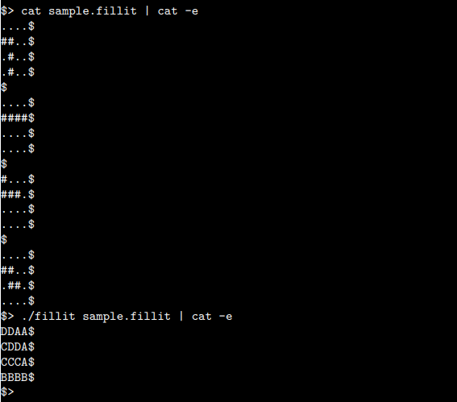

# fillit
C program that receives a list of random tetris blocks and arrange them in the smallest possible square. 
A coding excercise in parsing and recursion.

## Usage
Repository contains a Makefile for:  
* compiling executable (**make all**) 
* removing object files (**make clean**) 
* deleting executable (**make fclean**) 
* recompiling (**make re**)  

**Tetris blocks** 
* Given in 4 lines of 4 characters each.  
* Tetris block consists of 4 '#' characters. Empty spaces indicated by '.' 
* Each tetris block is seperated by an empty line 
* Invalid file format or invalid tetris block returns 'error' on the standard output 
* Example of valid input, running and output: 
   
#### Notes:
This project was done together with [T7Q](https://github.com/T7Q) and is part of my studies at Hive Helsinki. 
My part of the code handles the validation and parsing of the tetris blocks.  
The project was tested by 3 fellow Hive students as well as an automated evaluation system.

